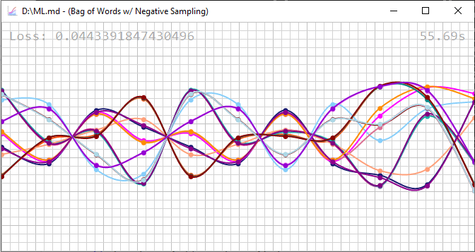

## Command line parameters

### --fit <dir>

Specifies the data directory.

```
ml --fit D:\ml\data\
```



CBOW | 11

**paris** | 1 | -2.773867-i0.03391842 0.8698528-i0.7975746 -0.859448+i0.8017766 2.767368+i0.03192855 -2.767578-i0.03198986 0.8600292-i0.8013908 -0.8608426+i0.8014258 0.860862-i0.801521 1.485024+i4.989345 4.586178-i0.9211909 -5.273708-i0.8344217
**fruit** | 1 | -0.558793+i0.1823055 -0.3970533-i2.093627 0.3866851+i2.083158 0.5885003-i0.1792204 -0.5862271+i0.1791139 -0.3865678-i2.084056 0.3845885+i2.079587 -0.3840583-i2.080288 -0.6337996-i1.45081 -0.7641315-i5.28094 1.232064+i2.28985
**french** | 1 | 2.466282+i2.996512 0.8367991-i0.8100945 -0.8263823+i0.8139668 -2.472067-i2.997444 2.472353+i2.997662 0.8280748-i0.8134926 -0.8268934+i0.8147781 0.8273878-i0.8145548 -6.175208+i1.402801 3.046899-i1.53573 -3.576028+i0.3348819
**english** | 1 | 2.512614+i3.030267 0.9541871-i0.8165008 -0.9459343+i0.8209788 -2.517423-i3.031693 2.517615+i3.031976 0.9470743-i0.8201967 -0.9460741+i0.8219067 0.9465649-i0.8216768 -6.20506+i1.430754 3.128771-i1.534769 -3.378261+i0.3554763
**C** | 1 | 1.502036+i2.345645 2.671115+i0.2270176 -2.667388-i0.2245622 -1.505184-i2.346848 1.505383+i2.346843 2.666896+i0.2237606 -2.668019-i0.2238868 2.668225+i0.2238567 -2.067149+i2.490103 3.963326-i1.101155 0.096458+i1.80365
**white** | 1 | -0.2815776+i1.591552 -0.7019821-i1.554929 0.701982+i1.575236 0.2747243-i1.599567 -0.2705086+i1.599557 -0.700627-i1.574687 0.7001184+i1.578271 -0.6989379-i1.577313 -0.7066965+i3.945377 3.0025+i3.695897 1.613847+i1.610261
**room** | 1 | 1.671979+i2.399105 1.773376-i0.5111723 -1.759243+i0.5154975 -1.681377-i2.402381 1.680668+i2.401941 1.757154-i0.5172851 -1.759901+i0.5162213 1.759608-i0.5166135 -1.633519+i3.426941 5.022312-i0.8612726 -6.477135-i1.00814
**cat** | 1 | -0.4239818+i1.057701 -0.2571802-i1.351382 0.2550331+i1.349667 0.4242499-i1.05665 -0.4237842+i1.056999 -0.2550718-i1.350244 0.2547798+i1.350229 -0.2544478-i1.350178 -1.714695+i3.009492 3.526295-i1.235859 -6.690528-i2.022069
**coffee** | 1 | 0.06491638+i1.325631 2.803999+i0.2489099 -2.82726-i0.25814 -0.05619609-i1.321225 0.05524441+i1.321089 2.824945+i0.2564192 -2.829224-i0.258281 2.827836+i0.2578464 0.6118466+i5.597434 5.186905-i0.3722551 -2.561285+i0.4405845
**apple** | 2 | -0.3522202-i0.2767813 -0.2953506-i0.271778 0.2896929+i0.2639138 0.3530054+i0.2795489 -0.3528991-i0.2794484 -0.2736273-i0.2624511 0.2663568+i0.2601093 -0.2668909-i0.2604462 -1.021418-i0.307858 0.03277269-i1.408606 0.3628594+i0.8610727
**spanish** | 1 | 2.46308+i3.011377 0.8254966-i0.8166108 -0.8162832+i0.8206143 -2.467689-i3.012404 2.468008+i3.012707 0.8181417-i0.8197594 -0.8170826+i0.8209327 0.8175346-i0.8206367 -6.004696+i1.349535 3.120409-i1.513576 -3.262956+i0.3518303
**black** | 1 | 0.0185538+i1.354434 -0.2934703-i1.552171 0.3062979+i1.57238 -0.03322804-i1.362897 0.01875682+i1.362454 -0.3062353-i1.569597 0.3069526+i1.573854 -0.311052-i1.573166 -0.4745985+i3.798036 3.687225+i3.759772 0.4671136+i1.804729
**eat** | 1 | -0.5145689+i0.2253627 -0.04555892-i1.955986 0.04157174+i1.947664 0.5095932-i0.2222203 -0.512914+i0.2218561 -0.0507295-i1.948972 0.05074284+i1.944983 -0.05226919-i1.945462 -1.187457-i1.550225 -0.3649743-i5.168062 0.3791308+i2.373638
**tokyo** | 1 | -2.887257-i0.02626272 0.9732056-i0.7897814 -0.9604101+i0.7944112 2.879823+i0.02417585 -2.880026-i0.02416247 0.9608119-i0.7933732 -0.9617203+i0.7933034 0.9617985-i0.7933941 1.576497+i4.980566 4.592271-i0.9422282 -5.21692-i0.8967502
**city** | 1 | -2.947516-i0.0434194 0.9820138-i0.8195418 -0.9723721+i0.8240701 2.941449+i0.04148591 -2.941557-i0.04166011 0.9723421-i0.8239127 -0.9732868+i0.8241427 0.9734432-i0.8242792 1.539797+i5.044926 4.832604-i0.920976 -5.417874-i0.8390327
**table** | 1 | 1.681252+i2.454082 1.778904-i0.5469999 -1.764771+i0.5497648 -1.69065-i2.456699 1.68994+i2.456383 1.762682-i0.5511628 -1.765429+i0.5498418 1.765136-i0.5502744 -1.614021+i3.430778 5.06911-i0.911638 -6.489852-i1.001934
**drink** | 1 | 0.03142079+i1.361455 2.824901+i0.2357695 -2.846143-i0.2446702 -0.02329847-i1.357551 0.0224531+i1.357353 2.843616+i0.2426378 -2.847596-i0.244596 2.84652+i0.2440743 0.6561004+i5.633383 5.175955-i0.3193433 -2.622737+i0.4151056
**new york** | 1 | -2.925715-i0.03908854 0.9893202-i0.8315676 -0.9791415+i0.8358442 2.919832+i0.03707684 -2.919945-i0.03727401 0.9793398-i0.8359864 -0.9802361+i0.836219 0.980343-i0.8363277 1.628688+i4.971903 4.778581-i0.9612277 -5.303572-i0.87117
**green** | 1 | -0.08023535+i1.487986 -0.3174048-i1.557109 0.3301695+i1.578774 0.07399324-i1.496453 -0.07282151+i1.49755 -0.3351541-i1.573434 0.3417543+i1.576936 -0.3399329-i1.575917 -0.2984749+i4.126954 2.960958+i3.659961 0.4234568+i1.610186
**chair** | 1 | 1.678431+i2.430468 1.787142-i0.5211269 -1.775615+i0.5250352 -1.686517-i2.433763 1.685808+i2.4334 1.773526-i0.526347 -1.776275+i0.5252597 1.775982-i0.5256669 -1.59968+i3.429842 5.001002-i0.830177 -6.486538-i1.024891
**los angeles** | 1 | -2.874945-i0.07517612 0.9636585-i0.7888719 -0.9534457+i0.7935532 2.868817+i0.07296732 -2.868985-i0.07317158 0.9540042-i0.7928487 -0.9547788+i0.7928339 0.9548621-i0.7929232 1.565463+i5.047524 4.675456-i0.9748392 -5.360907-i0.8180168
**german** | 1 | 2.462031+i3.001275 0.8548716-i0.8354188 -0.8457865+i0.8398066 -2.467212-i3.002683 2.467593+i3.002969 0.8468839-i0.8390252 -0.8459848+i0.8402006 0.8465464-i0.8399665 -6.111305+i1.405371 3.066643-i1.563101 -3.474089+i0.3028769
**monkey** | 1 | -0.5295407+i1.164497 -0.1982101-i1.347046 0.1958639+i1.345457 0.5302809-i1.163103 -0.5298409+i1.163219 -0.1960613-i1.34538 0.1958887+i1.345829 -0.1955441-i1.345748 -1.481812+i2.799081 3.460042-i1.293379 -6.768606-i1.957451
**door** | 1 | 1.682626+i2.400705 1.784358-i0.5328655 -1.77023+i0.5369946 -1.692021-i2.403881 1.691313+i2.403494 1.768133-i0.5384941 -1.770885+i0.5374401 1.770592-i0.5378184 -1.594796+i3.418364 5.044414-i0.8564204 -6.49348-i0.9815305
**animal** | 1 | -0.0460229+i1.214176 -0.439391-i1.402792 0.4367237+i1.401001 0.04653686-i1.212744 -0.04624469+i1.212852 -0.4370643-i1.400449 0.4367898+i1.401011 -0.4364581-i1.400998 -2.490591+i2.706103 3.507225-i1.324809 -6.573781-i1.956644
**red** | 1 | 0.1428908+i1.42631 -0.203742-i1.586167 0.2080144+i1.606395 -0.1428629-i1.436482 0.148511+i1.436721 -0.1968783-i1.602061 0.1930992+i1.605609 -0.191708-i1.605177 -0.50387+i3.937838 3.213288+i3.853372 -0.01617698+i1.769853
**wine** | 1 | -0.2081952+i1.323128 2.59667+i0.2309467 -2.623942-i0.2393823 0.219147-i1.319541 -0.2202073+i1.319244 2.620328+i0.2379097 -2.625516-i0.2394333 2.624226+i0.2388977 0.8845631+i5.443711 5.119981-i0.3024191 -3.025872+i0.4353345
**language** | 1 | 2.593322+i3.056352 1.17411-i0.8390287 -1.16529+i0.8437626 -2.598366-i3.057837 2.598695+i3.058099 1.166636-i0.842936 -1.165656+i0.8447093 1.166227-i0.8444195 -5.996267+i1.442609 3.103512-i1.49916 -3.174463+i0.3663962
**tea** | 1 | -0.2192803+i1.321159 2.857384+i0.2174944 -2.874335-i0.2258385 0.2254343-i1.317808 -0.2261765+i1.317743 2.871794+i0.2237535 -2.87569-i0.2254919 2.8749+i0.224963 0.8347785+i5.549302 5.325614-i0.303615 -2.617179+i0.4395911
**cow** | 1 | -0.2514071+i1.04949 -0.4100424-i1.334913 0.4089185+i1.333035 0.2507817-i1.048044 -0.2505605+i1.048287 -0.4091445-i1.333311 0.4087206+i1.333486 -0.4083434-i1.333431 -2.21222+i2.997888 3.172214-i1.235174 -6.488907-i2.010121
**milk** | 1 | 0.1643664+i1.296922 2.725585+i0.230634 -2.752456-i0.2388726 -0.1539024-i1.293586 0.1528808+i1.293463 2.748966+i0.2372717 -2.754215-i0.2388666 2.75289+i0.2384344 0.5434789+i5.46469 5.043438-i0.3575115 -2.687902+i0.4482804
**blue** | 1 | -0.137984+i1.274608 -0.4961776-i1.452976 0.5066726+i1.468752 0.1259243-i1.282597 -0.1247856+i1.282623 -0.5193933-i1.466197 0.5208356+i1.468543 -0.5200829-i1.467799 -0.7557589+i3.743371 3.090124+i3.478458 0.9130614+i1.727514
**amazon** | 1 | -0.2427806+i0.9494058 0.9082641+i0.9077973 -0.901301-i0.8930529 0.2457503-i0.9550026 -0.2440129+i0.9553865 0.8452834+i0.8969393 -0.8238009-i0.8937143 0.8280354+i0.8944973 -0.3753708+i4.453989 -0.4451035-i4.943907 -1.436812-i2.00246
**food** | 1 | -0.6955315+i0.2470737 -0.3874644-i1.874367 0.3807513+i1.867346 0.6858773-i0.2448269 -0.6882633+i0.2447173 -0.3901013-i1.871103 0.3897285+i1.868392 -0.3901975-i1.868742 -1.050295-i1.254706 -0.7807715-i5.143597 1.432299+i2.500331
**water** | 1 | 0.1368566+i1.307027 2.843467+i0.2218974 -2.86396-i0.2300371 -0.1287378-i1.303561 0.1279698+i1.303418 2.861703+i0.228763 -2.865856-i0.2303584 2.864804+i0.2299193 0.5837506+i5.507867 5.210412-i0.2541612 -2.445302+i0.4347014
**Java** | 1 | 1.7938+i2.353454 2.792514+i0.2393377 -2.788682-i0.2372589 -1.797551-i2.354209 1.79759+i2.354114 2.789203+i0.237736 -2.790077-i0.2378704 2.790088+i0.237811 -2.669456+i2.457523 4.144901-i1.121649 -0.2526428+i1.786465
**orange** | 2 | -0.5187781-i0.1009001 -0.1256021-i0.5936999 0.1243564+i0.5930955 0.5130097+i0.100977 -0.5110225-i0.1005701 -0.1223033-i0.5936103 0.1243631+i0.5932785 -0.1240349-i0.5931487 -0.5565585+i0.1695381 -0.1051929+i0.5234182 0.723279+i1.209014
**google** | 1 | -0.2515285+i1.070693 0.9340427+i0.9550699 -0.9271535-i0.9377965 0.2519901-i1.075911 -0.2521991+i1.076514 0.9480851+i0.938217 -0.9509681-i0.9345881 0.949577+i0.9358927 -0.4631869+i4.575609 -0.2044421-i5.237999 -1.71534-i2.290059
**dog** | 1 | -0.4044229+i1.087391 -0.2897232-i1.335914 0.2880023+i1.334464 0.4043956-i1.08641 -0.4040516+i1.086472 -0.2882986-i1.334719 0.2879696+i1.33507 -0.2875665-i1.335069 -1.746413+i2.973339 3.502872-i1.254676 -6.702014-i1.994375
**JavaScript** | 1 | 1.692289+i2.370458 2.746733+i0.2271119 -2.742894-i0.2250678 -1.695609-i2.371307 1.69577+i2.371291 2.743184+i0.2256049 -2.74402-i0.2256878 2.744068+i0.2256038 -2.613194+i2.469914 3.745578-i1.142036 -0.08298605+i1.78227
**human** | 1 | -0.4482755+i1.376855 -0.1916488-i1.475678 0.1891869+i1.47353 0.4491568-i1.375115 -0.4486499+i1.375369 -0.1890238-i1.47353 0.1886743+i1.473859 -0.1883322-i1.47382 -1.563924+i2.581547 3.561088-i1.355345 -6.818422-i1.997236
**C#** | 1 | 1.674665+i2.395822 2.578388+i0.2190384 -2.574318-i0.2170311 -1.678834-i2.396648 1.678949+i2.396514 2.573919+i0.2173316 -2.574123-i0.2173821 2.574302+i0.2173053 -2.439194+i2.501594 3.865597-i1.120198 -0.08655536+i1.792951
**C++** | 1 | 1.655865+i2.341766 2.521304+i0.2375801 -2.517784-i0.2352612 -1.659303-i2.342817 1.659364+i2.342819 2.518638+i0.2353124 -2.519128-i0.2354684 2.519054+i0.2354427 -2.431877+i2.523792 3.86087-i1.121043 -0.04062611+i1.798054
**beer** | 1 | -0.4280901+i1.297811 2.778898+i0.2315263 -2.799696-i0.2399344 0.4361701-i1.294159 -0.4370281+i1.29397 2.796824+i0.2377138 -2.801166-i0.2394421 2.800223+i0.2390402 1.098639+i5.473695 5.426747-i0.2989489 -3.026355+i0.4165714
**microsoft** | 1 | -0.1126643+i0.7970399 0.9207723+i0.9445429 -0.9140226-i0.9321175 0.1162483-i0.801475 -0.1163523+i0.8019364 0.9336292+i0.9355266 -0.9383129-i0.9319012 0.93769+i0.9329075 -0.2768531+i4.606683 0.09369268-i5.046762 -1.821538-i2.070758
